ວິຊາ :  ໄມໂຄຣໂປຣເຊັດເຊີ ແລະ ໄມໂຄຣຄອມພິວເຕີ

ສອນໂດຍ :  ປຕ. ນາງ ລັດທິດາ ຄົມສອນລະສິນ

ຮຽບຮຽງໂດຍ : ທ ກິດທິສັກ ກອງແພງຕາ ຫ້ອງ 3COM2

Email : lay.kitthisak@gmail.com

WhatsApp : +8562077669175

#ບົດນຳ

          ບົດລາຍງານນີ້ເປັນການສະຫລຸບບົດຮຽນການສືກສາຮຽນຮູ້ ແລະ ປະຕິບັດຕົວຈິງຂອງການສຶກສາໃນການຕໍ່ວົງຈອນເອເລັກໂຕຣນິກໂດຍນຳໃຊ້ ອຸປະກອນໃນແລັບ. ຕະຫລອດໃນການສຶກສາ ແລະ ປະຕິບັດຕົວຈິງທີ່ຜ່ານມາສາມາດຮູ້ໄດ້ວ່າການທົດລອງສາມາດນຳໄປໃຊ້ໃນຊິວິດປະຈຳວັນ ແລະ ອຸສາຫະກຳເພື່ອເພີ່ມປະສິດທິພາບ,ຄວາມສະດວກສະບາຍ. ເຊີງຫວັງວ່າ, ບົດລາຍງານນີ້ຈະສາມາດຊ່ວຍບຸກຄົນທີ່ສົນໃຈ ແລະ ໄປຕໍ່ຍອດໃຫ້ເກິດປະໂຫຍດຫລາຍຂື້ນ

# **ແນະນຳອຸປະກອນໃນການໃຊ້ງານ**

| **NO:** | Program        | Type                       | How to use                                                                     |
| ------- | -------------- | -------------------------- | ------------------------------------------------------------------------------ |
| 1       | Git ver 2.47.0 | Sofwars/Coommand-line sool | ໃນການຈັດການເວີຊັນຂອງໂຄດ ແລະ ການເຮັດວຽກຮ່ວມກັນໃນການພັດທະນາ Software             |
| 2       | Arduino IDE    | Application                | Arduino IDE ໃຊ້ຂຽນໂຄດ ແລະ ອັບໂຫຼດໄປທີ່ບອດ Arduino                              |
| 3       | Obsidian       | Application                | Obsidianໃຊ້ສ້າງ ແລະ ຈັດການເຄື່ອຂ່າຍຂອງ ໂນດ (Nose) ທີ່ເຊື່ອມຕໍ່ກັນ              |
| 4       | Fritzing       | Application                | Fritzing ໃຊ້ສ້າງແຜນຜັງວົງຈອນ, ເລເອົ້າບອດ ທົດລອງ (Breadboard) ແລະ ການອອກແບບ PCB |
| 5       | Tinkercad      | Web-based tool             | Tinker cad ໃຊ້ສ້າງໂມເຕວ 3D, ຈຳລອງວົງ ຈອນໄຟຟ້າ ແລະ ໂປຣແກຣມໄມໂຄຣຄອນໂທຣລີ         |
| 6       | VS code        | Application                | VS codeໃຊ້ຂຽນ ແລະ ແກ້ໄຂ Code ໃນຫຼາຍ ພາສາ                                       |

# ແນະນຳອຸປະກອນທີ່ໃຊ້ໃນການຕໍ່ວົງຈອນ

**1.**   Arduino Uno

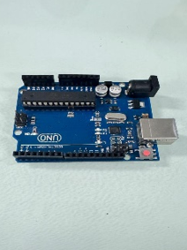

	Board ຄວບຄຸມໄມໂຄຣ ສໍາລັບການພັດທະນາໂຄງການ DIY, ການຮຽນຮູ້ການຂຽນໂປລແກລມ, ການຄວບຄຸມອຸປະກອນຕ່າງໆ

**2.**   **Breadboard**

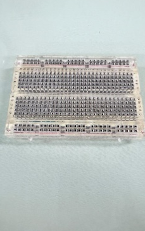

	Boardໃຊ້ສໍາລັບການເຊື່ອມຕໍ່ວົງຈອນໄຟຟ້າຊົ່ວຄາວ ຫຼື ໃຊ້ເພື່ອທົດສອບວົງຈອນຕ່າງໆ ກ່ອນທີ່ຈະ soldering ໃສ່Boardວົງຈອນ

**3.**   **Resistor**

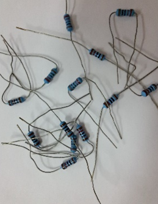

	ເປັນອຸປະກອນທີ່ເຮັດໜ້າຫຼຸດຜ່ອນແຮງດັນໄຟຟ້າໃນວົງຈອນ. ຄວບຄຸມກະແສໄຟຟ້າໃນວົງຈອນ ໃຊ້ໃນທຸກວຽກງານເອເລັກໂຕຣນິກ

**4.**    **pin header                     

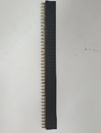
	ເປັນອຸປະກອນທີ່ເຊື່ອມຕໍ່ວົງຈອນຫຼືສາຍໄຟໃນຮູບແບບ plug-in. ເຫມາະສໍາລັບການເຊື່ອມຕໍ່ກັບໂມດູນຫຼືBoardວົງຈອນ.

**5.**   **Jumper**
 

!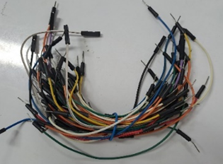

	ສາຍທີ່ໃຊ້ເພື່ອເຊື່ອມຕໍ່ລະຫວ່າງ pins ອຸປະກອນຕ່າງໆຢູ່ໃນກະດານແລະ Breadboard.

**6.**   **LED**

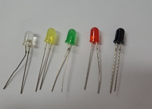

	ໃຊ້ເພື່ອສະແດງສະຖານະຫຼືການສະຫວ່າງ. ມີຢູ່ໃນຫຼາຍສີແລະຂະຫນາດ. ໃຊ້ໃນວຽກງານເອເລັກໂຕຣນິກທົ່ວໄປ

**7.**   **RGB LED**

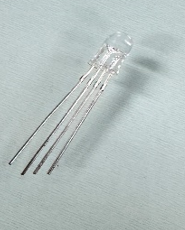

	ເປັນຫລອດໄຟ LED ທີ່ມີສີແດງ, ສີຂຽວ, ແລະສີຟ້າຢູ່ໃນຫລອດດຽວ. ແສງສະຫວ່າງສາມາດໄດ້ຮັບການປະສົມເພື່ອສ້າງສີທີ່ແຕກຕ່າງກັນ.

**8.**   **7-segment 5611**

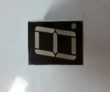

	ຈໍສະແດງຜົນ 7-segment ໃຊ້ເພື່ອສະແດງຕົວເລກເຊັ່ນ: 0-9.

**9.**   segment

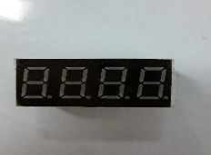

	ການສະແດງ segment 7 ຕົວເລກຕິດຕໍ່ກັນໃຊ້ເພື່ອສະແດງເວລາ ຫຼືຕົວເລກຍາວ.

**10.**   Button control(mini, switch)

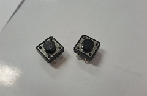

	ໃຊ້: ເປີດ/ປິດປຸ່ມກົດ ຫຼືຄວບຄຸມການເຮັດວຽກຂອງວົງຈອນ ເຫມາະສໍາລັບໂຄງການຄວບຄຸມ.

**11.**               **Buzzer**

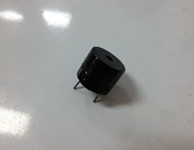

	ສົ່ງສຽງແຈ້ງເຕືອນຫຼືໃຊ້ໃນໂຄງການທີ່ຕ້ອງການສຽງເຊັ່ນ: ໂມງປຸກ, ລະບົບປຸກ.

**12.**               **Servo**

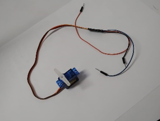

	ເປັນມໍເຕີທີ່ສາມາດຄວບຄຸມຕໍາແຫນ່ງຫມຸນ. ໃຊ້ທົ່ວໄປໃນວຽກງານການຄວບຄຸມການເຄື່ອນໄຫວ, ເຊັ່ນ: ການຄວບຄຸມແຂນກົນຈັກ.

**13.**  IcN74HC595N

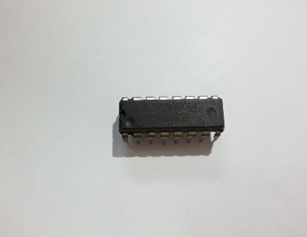

	ຂະຫຍາຍພອດແມ່ນໃຊ້ເພື່ອຄວບຄຸມໄຟ LED ຫຼືອຸປະກອນທີ່ຕ້ອງການພອດຫຼາຍພອດໂດຍນໍາໃຊ້ພອດຫນ້ອຍລົງຈາກໄມໂຄຄອນຄວບຄຸມ.

**14.**  Bluetooht Module

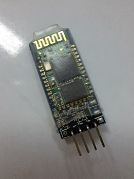

	ໃຊ້ເພື່ອຕິດຕໍ່ສື່ສານໄຮ້ສາຍຜ່ານ Bluetooth, ເຫມາະສໍາລັບການສົ່ງຂໍ້ມູນລະຫວ່າງອຸປະກອນເຊັ່ນ: ໂທລະສັບມືຖືແລະ Arduino.

**15.**  **Battery DC 9V**

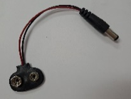

	ແຫຼ່ງພະລັງງານສໍາລັບວົງຈອນຫຼືອຸປະກອນ Portable. ໃຊ້ໃນໂຄງການທີ່ບໍ່ຈໍາເປັນຕ້ອງສຽບໄຟໃນເຮືອນ.

**16.**  USB cable

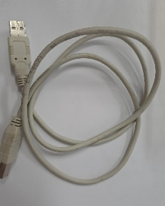

	ສາຍເຊື່ອມຕໍ່ສໍາລັບການສົ່ງຂໍ້ມູນແລະການສະຫນອງພະລັງງານ, ເຊັ່ນ: ການເຊື່ອມຕໍ່ Arduino ກັບຄອມພິວເຕີ

**17.**               **Joy stick module**

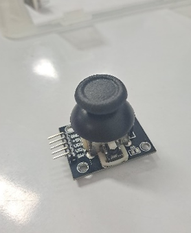

	ຄວບຄຸມການເຄື່ອນໄຫວໃນຫຼາຍທິດທາງ, ເຊັ່ນ: ຫຸ່ນຍົນຫຼືຄວບຄຸມເກມ.

**18.**               **Potentiometer(10k ohm linear taper rotary potentiometer)**

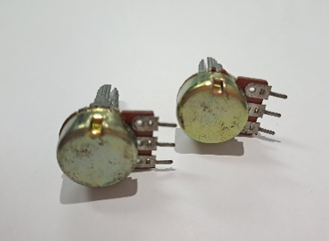

	ໃຊ້ເພື່ອປັບແຮງດັນໄຟຟ້າໃນວົງຈອນໄດ້ດີສໍາລັບການປັບຄວາມສະຫວ່າງ, ລະດັບສຽງ, ຫຼືການຕັ້ງຄ່າໃນອຸປະກອນຕ່າງໆ.

**19.**               **LED Matrix**

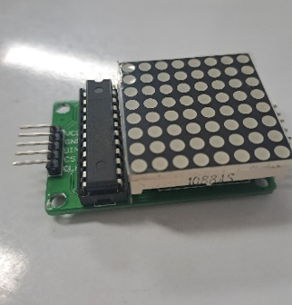
	ຂໍ້ຄວາມຫຼືຮູບແບບທີ່ມີໄຟ LED, ເຫມາະສໍາລັບປ້າຍໂຄສະນາ, ໂມງ, ຫຼືເຄື່ອງຕົກແຕ່ງ.

**20.**   **LCD display 1602**

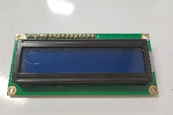
	ຈໍສະແດງຜົນທີ່ໃຊ້ເພື່ອສະແດງຕົວອັກສອນ ແລະຕົວເລກ. ສໍາລັບການສະແດງຂໍ້ມູນຕ່າງ

**21.**                **IR LED (10*3 mm led infrared receiver 940nm IR LED diodes IR)**

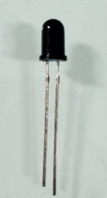

	ໃຊ້ໃນການຮັບສັນຍານ IR ທີ່ຖືກສົ່ງມາຈາກ LED ຂອງອຸປະກອນຕ່າງໆ.

v     **ປະເພດຂອງ** **SENSOR**

**1.**    **Ultrasonic Sensor**

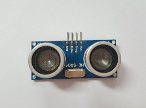

	ແມ່ນການວັດແທກໄລຍະຫ່າງໂດຍໃຊ້ຄື້ນສຽງ ultrasonic. ເຫມາະສໍາລັບລະບົບກວດຈັບອຸປະສັກ, ລະບົບການຄວບຄຸມໄລຍະໄກຂອງຫຸ່ນຍົນ.

**2.**   **PIR Sensor**

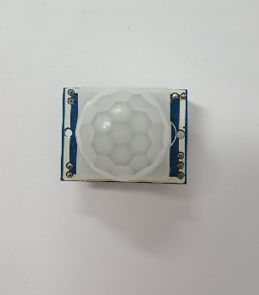            

	ຕົວຈັບການເຄື່ອນໄຫວ ໃຊ້ສຳລັບລະບົບຄວາມປອດໄພ

**3.**   **Reflective object sensor**

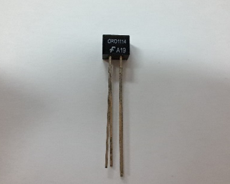

	ເຊັນເຊີກວດຈັບວັດຖຸສະທ້ອນ ໃຊ້ໃນການກວດຫາວັດຖຸໄລຍະໃກ້, ເຊັ່ນ: ກວດພົບເຈ້ຍໃນເຄື່ອງພິມ.

**4.**   **Temperature Sensor (LM35 DZ)**

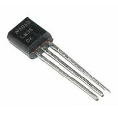
	ແມ່ນເຊັນເຊີທີ່ໃຊ້ວັດອຸນຫະພູມແບບລະດັບສູງ ແລະ ແມ່ນມີຄວາມແມ່ນຍຳສູງຫຼາຍ. ໂດຍຖ້າອຸນຫະພູມເພີ່ມຂຶ້ນ ຄ່າໄຟອອກທາງຂອງເຊັນເຊີກໍຈະເພີ່ມຂຶ້ນເຊັ່ນກັນ.

**5.**   **Rain Drop Sensor**

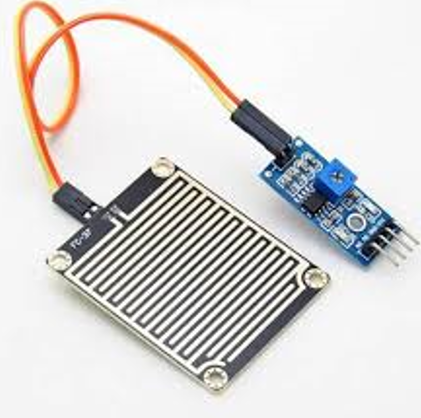
	ແມ່ນເຊັນເຊີທີ່ມີໜ້າທີ່ວັດການມາຖຶກຂອງນໍ້າຝົນ ຫຼື ຄວາມຊື່ນຫມອກໃນສະຖານທີ່ທີ່ມີນໍ້າ. ເຊັນເຊີນີ້ຖືກໃຊ້ໃນການຕິດຕັ້ງກັບລະບົບຄວບຄຸມທີ່ເຊື່ອມໂຕກັບອຸປະກອນຕ່າງໆ

**6.**    **Mercury Switch Tilt Sensor**

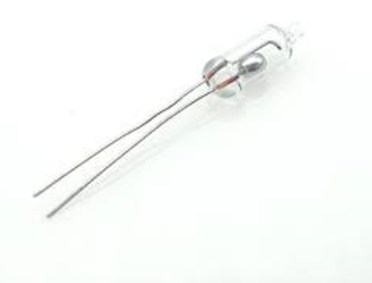

	ເປັນເຊັນເຊີທີ່ເປັນສະວິດສະຫຼັບໄຟຟ້າ.  ເພື່ອເປີດແລະປິດວົງຈອນຕາມຄວາມອຽງຂອງເຊັນເຊີ

# ການທົດລອງຕໍ່ວົງຈອນ Labs:0 BlinK

    I.     ຈຸດປະສົງຂອງວົງຈອນການທົດລອງ

	Blink Arduino ເປັນໂປຣເຈັກເລີ່ມຕົ້ນຂອງການຮຽນຮູ້ສຳລັບຜູ້ທີ່ຕ້ອງການເລີ່ມຕົ້ນສຶກສາໃຊ້ງານ ໄມໂຄຣຄອນໂທຣເລີ. ໂດຍການເຮັດວຽກຂອງມັນ ຈະເຮັດໃຫ້ LED ທີ່ຕິດຢູ່ພືີ້ນຂອງ LED_BUILTIN ຮຸ້ງແລະດັບທຸກໆ 1 ວິນາທີ. ຈຸດປະສົງຂອງຕໍ່ວົງຈອນ Blink Arduino ແມ່ນເພື່ອໃຊ້ໃນການກວດສອບການເຮັດວຽກຂອງບອດ(Arduino) ວ່າໃຊ້ງານໄດ້ຫລືບໍ່.

   **II.**        ອຸປະກອນ

| ຊື່         | ຈຳນວນ |
| ----------- | ----- |
| Arduino ide | * 1   |
| ສາຍUSB      | * 1   |

 **III.**        ວົງຈອນແລະ

           
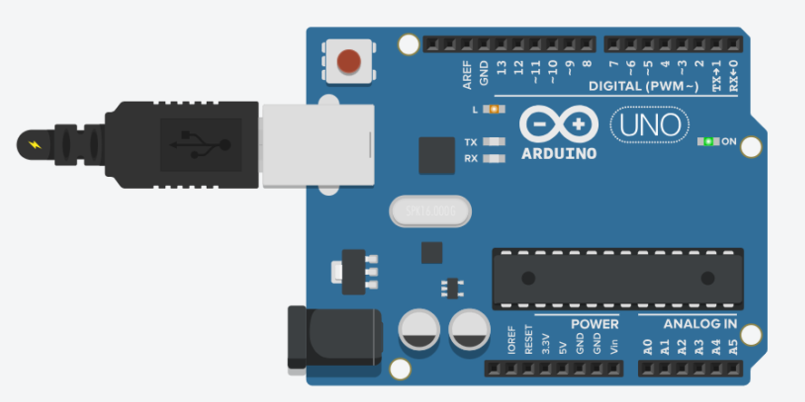

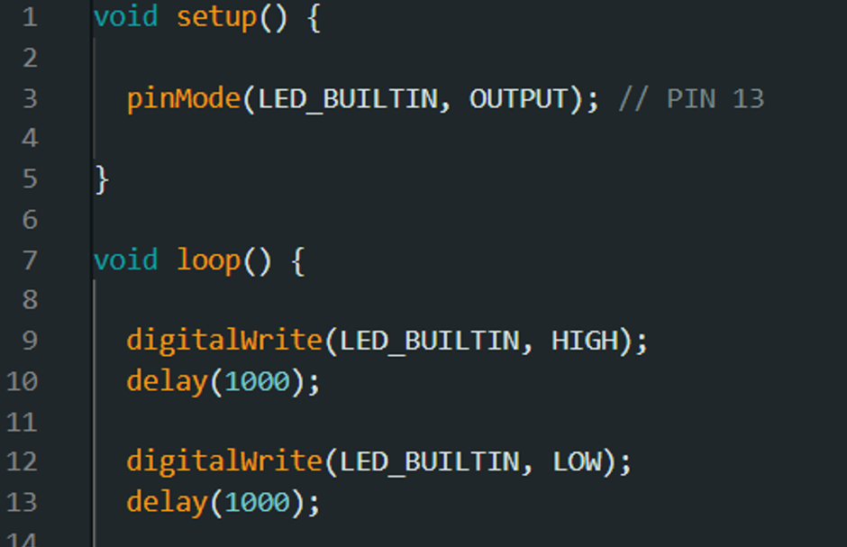
 **IV.**        ຜົນຂອງການທົດລອງ

	ຜົນການທົດລອງການສາມາດສະຫລຸບໄດ້ວ່າ ການເຮັດຂອງບອດ (Arduino) ນັ້ນສາມາດເຮັດວຽກໄດ້ຢ່າງປົກກະຕິ, ໂດຍມັນຈະເປັນມັນຈະເປັນການກະພິບຕາມຈັງຫວະຮຸ້ງ-ດັບ ທຸກໆ1ວິນາທີ.

  

# ການທົດລອງຕໍ່ວົງຈອນ Labs:1 Exper Blink

**I.**   ຈຸດປະສົງແລະວົງຈອນການທົດລອງ

	Experement Blink ເປັນໂປຣເຈັກທີ່ມີການໃຊ້ບອດ (Arduino) ໃນການຄວບຄຸມການກະທິບຂອງດອກໄຟ LED, ໂດຍມັນຈະມີການຮຸ້ງ-ດັບສະຫລັບກັນທຸກໆ 1 ວິນາທິ.

   **II.**        ອຸປະກອນ

**II.**        ອຸປະກອນ

| ຊື່            | ຈຳນວນ |
| -------------- | ----- |
| Arduino ide    | * 1   |
| Breadboard     | * 1   |
| Resistor(220Ω) | * 1   |
| LED            | * 1   |
| ສາຍ USB        | * 1   |

 **III.**        ວົງຈອນແລະໂຄດ

             

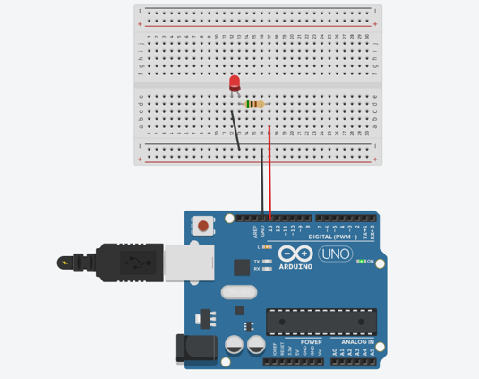
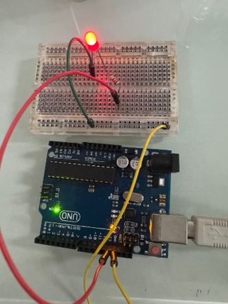             
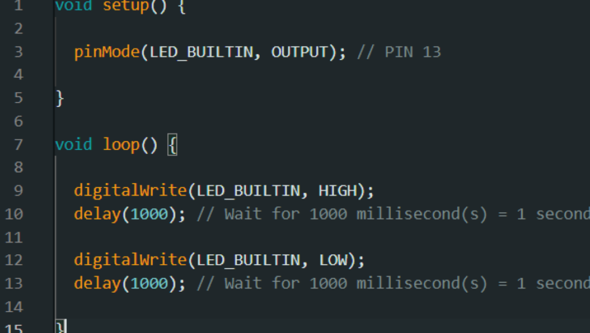
**IV.**          ຜົນຂອງການທົດລອງ

	ຜົນການທົດລອງການສາມາດສະຫລຸບໄດ້ວ່າ ການເຮັດວຽກຂອງດອກໄຟ LED ນັ້ນໄດ້ມີການສະແດງຜົນຕາມທີ່ເຮົາຕ້ອງ,ໂດຍມັນຈະມີການຮຸ້ງ-ດັບສະຫລັບກັນ 1 ວິນາທີ. ໂດຍຫລັງມັນຈະເຮັດວຽກແລ້ວຈະມີການວົນຊ້ຳ(loop)ໄປເລື້ອຍໆຈົນກສ່າເຮົາສັ່ງຈຸດການເຮັດວຽກມັນ.

# ການທົດລອງຕໍ່ວົງຈອນ Labs:2  Switch

**I.**   ຈຸດປະສົງແລະວົງຈອນການທົດລອງ

	Switch or **Push button (****ປຸ່ມກົດ****)** ເປັນອຸປະກອນໄຟຟ້າທີ່ໃຊ້ໃນວົງຈອນອິເລັກໂທຣນິກ ເພື່ອປິດຫຼືເປີດວົງ ຫລື ສົ່ງສັນຍານໄປຍັງວົງຈອນ. ໂດຍມັນຈະມີການເຮັດວຽກລັກສະນະເມື່ອມີການກົດລົງເພື່ອເຮັດໃຫ້ວົງຈອນມີກະແສໄຟຟ້າແລ່ນຜ່ານໄປຍັງວົງຈອນ.

	 Switch or **Push button** **ໃນໂປຣເຈັກນີ້ຈະເປັນການນຳໃຊ້** Switch ໃນການຄວບຄຸມໄຟຈາກບອດເພື່ອໃຫ້ໄຟຈາກບອດນັ້ນຮຸ້ງແລະດັບ.

**II.**        ອຸປະກອນ

| ຊື່             | ຈຳນວນ |
| --------------- | ----- |
| Arduino ide     | * 1   |
| Breadboard      | * 1   |
| Resistor(10KΩ)  | * 1   |
| **Push button** | * 1   |

**III.**        ວົງຈອນແລະໂຄດ

             

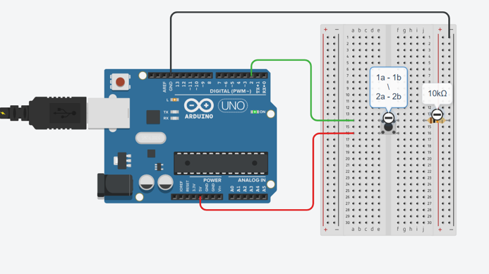
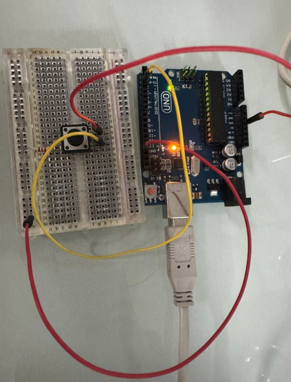
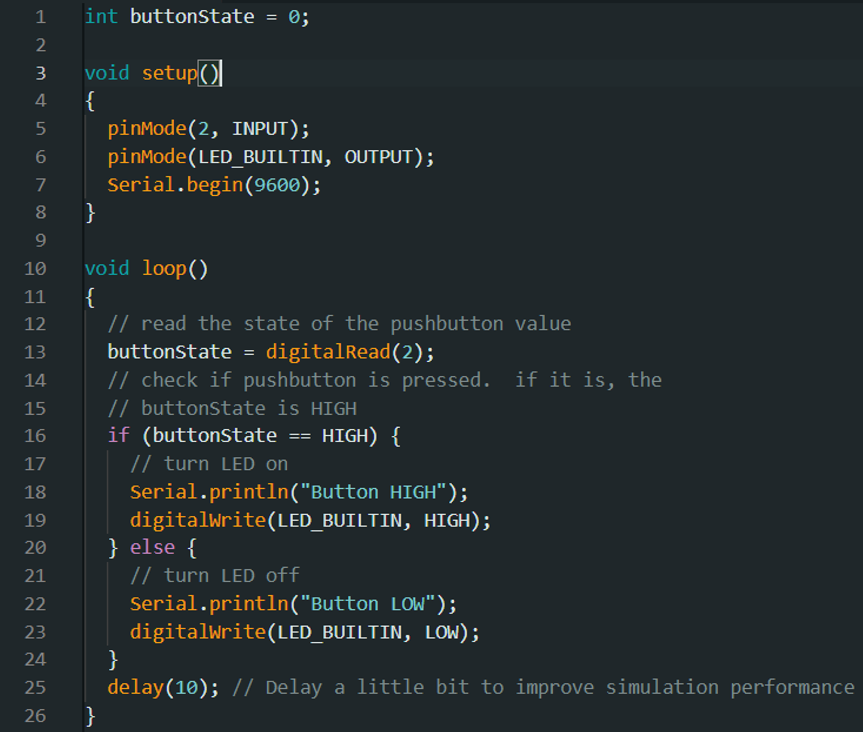

**IV.**        ຜົນຂອງການທົດລອງ

	ຜົນການທົດລອງການສາມາດສະຫລຸບໄດ້ວ່າ: ໂປຣເຈັກນີ້ແມ່ນ**ຈະເປັນການໃຊ້ໄຟຈາກບອດ**(Arduino)  5V ຜ່ານ Switch, ເມືອ ເອົາມືກົດທີ່ Switch ມີໄຟຟ້າແລ່ນຜ່ານວົງຈອນມັນຈະມີໄຟຮຸ້ງຢູ່ທີ່ບອດ ແລະ ເມືອເອົາມືອອກຈາກ Switch ໄຟທີ່ຢູ່ໃນບອດນັ້ນກໍ່ຈະດັບລົງນຳໂດຍທີມັນຈະມີການ deday (10) ກ່ອນໄຟຈະດັບລົງ. 

  
# ການທົດລອງຕໍ່ວົງຈອນ Labs:3 RCB

**I.**   ຈຸດປະສົງແລະວົງຈອນການທົດລອງ

	RGB ແມ່ນ ຊຸດຫຼອດໄຟ LED ທີ່ມີຫຼອດໄຟ LED ສີແດງ, ຂຽວ ແລະນ້ຳເງິນລວມກັນໃນຊຸດດຽວ ຕາມປົກກະຕິແລ້ວ ໄຟ LED ແບບ RGB ສາມາດສ້າງສີຕ່າງໆ ທີ່ມອງເຫັນໄດ້ຄ່ອນຂ້າງຄົບຄຸມ. ຢ່າງໃດກໍ່ຕາມ, ຂໍ້ຈຳກັດຂອງໄຟປະເພດນີ້ ແມ່ນວ່າທັງຊຸດຂອງໄຟ LED ຈະສາມາດສ້າງແສງສີດຽວໃນເວລາດຽວກັນເທົ່ານັ້ນ ແລະໃຊ້ເອັຟເຟັກແສງແບບດຽວກັນ ເນື່ອງຈາກມີ IC ຕົວດຽວຄວບຄຸມການເຮັດວຽກ.

	 RGB ໃນໂປຣເຈັກນີ້ຈະເປັນການທີ່ທີ່ໃຊ້ຄໍາສັ່ງໃຫ້ດອກໄຟປ່ຽນສີຂອງມັນຕາມຄ່າທີ່ເຮົາເຊັດໄວ້ ແລະ ໃຊ້ຄຳສັ່ງໂດຍສັ່ງຜ່ານ Serial Monitor ຫລື ຜ່ານບອດຂອງວົງຈອນໃນການປ່ຽນສີຂອງໂດຍໄຟ.

**II.**        ອຸປະກອນ

| ຊື່            | ຈຳນວນ |
| -------------- | ----- |
| Arduino ide    | * 1   |
| Breadboard     | * 1   |
| Resistor(220Ω) | * 1   |
| RGB            | * 1   |

**III.**        ວົງຈອນແລະໂຄດ

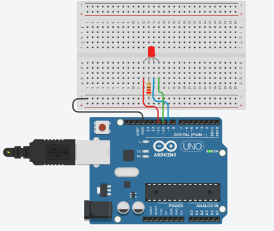
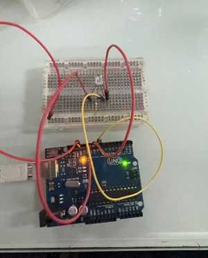]]     
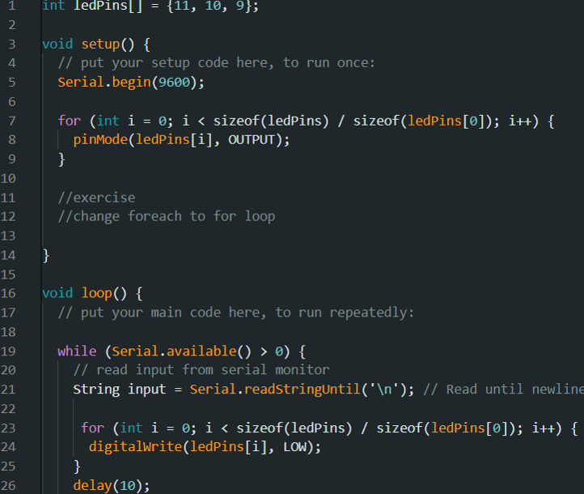
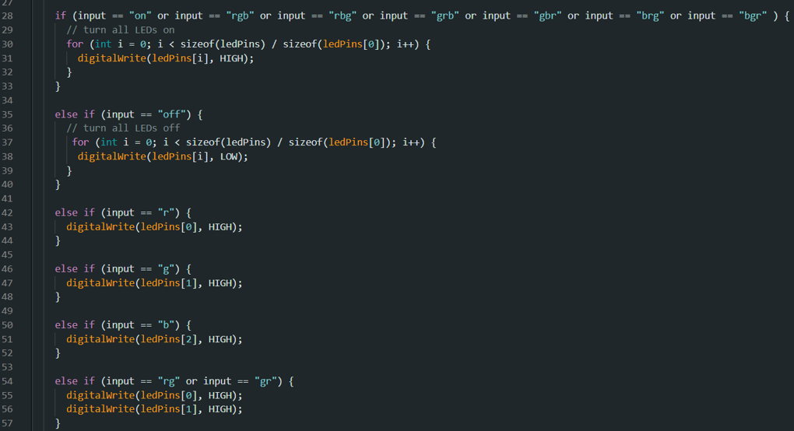
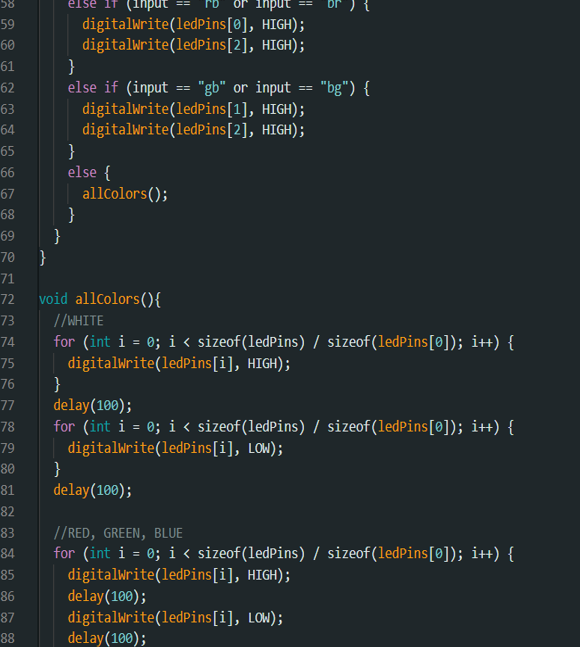
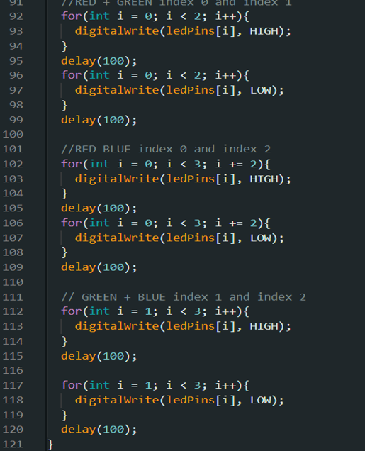
  
**IV.**        ຜົນຂອງການທົດລອງ

	ຜົນການທົດລອງການສາມາດສະຫລຸບໄດ້ວ່າ: ໂປຣເຈັກນີ້ແມ່ນ**ຈະເປັນການໃຊ້ດອກໄຟ** **RGB ຕາມຄ່າທີ່ເຮົາກໍາເອົາໄວ້, ເຊີ່ງເຮົາໄດ້ກຳນົດຄື:** **r** **ຈະເປັນສີແດງ,** **g ຈະເປັນສີຂຽວ ແລະ b ຈະເປັນສີຟ້າ.ແຕ່ຖ້າເຮົາຢາກປະສົມສີກໍ່ສາມາດເຮັດໄດ້ໂດຍນຳເອົາ 3ແມ່ສີຫລັກ (****r, g, b****) ໄປໃສ່ໃນ** Serial Monitor ຫລື ຜ່ານບອດ, ຖ້າຢາກປະສົມສອງສີກໍ່ໃສ່ອັນ ແລະ ຖ້າໄດ້ສາມສີກໍ່ໃສ່ສາມອັນຄື: rg(ສີເຫລືອງ), gb(ສີນໍ້າເງີນ), rgb(ສີຂາວ)…. ແລ້ວດອກໄຟຈະເປັນສີນັ້ນຈົນກວ່າເຮົາປ່ຽນສີ ຫລື ປົດມັນລົງໄປ.

# ການທົດລອງຕໍ່ວົງຈອນ Labs:4 Buzzer

**I.**         ຈຸດປະສົງແລະວົງຈອນການທົດລອງ

Buzzer (ບັຊເຊີຣ໌) ຄື ອຸປະກອນກຳເນີດສຽງ ທີ່ໃຊ້ໃນລະບົບອີເລັກໂທຣນິກ ເພື່ອສ້າງສຽງແຈ້ງເຕືອນ, ສັນຍານ, ຫລືເພື່ອໃຫ້ສຽງປິ່ງປ່ອງຕ່າງໆ. ປະເພດຂອງ Buzzer ມີຄື:

1. **Passive Buzzer** (ບັຊເຊີຣ໌ແບບບໍ່ມີວົງຈອນ)

- ຕ້ອງໃຊ້ສັນຍານຄວາມຖີ່ (PWM) ເພື່ອຄວບຄຸມສຽງ
- ສາມາດສ້າງສຽງດັງ ແລະ ປ່ຽນຄວາມຖີ່ສຽງໄດ້

2. **Active Buzzer** (ບັຊເຊີຣ໌ແບບມີວົງຈອນໃນຕົວ)

- ໃຫ້ສຽງໄດ້ໂດຍການຈ່າຍໄຟ DC ໃສ່
- ສຽງຄົງທີ່ ແລະ ບໍ່ສາມາດປ່ຽນຄວາມຖີ່ໄດ້

v Buzzer (ບັຊເຊີຣ໌) ໃນໂປຣເຈັກນີ້ຈະເປັນການທີ່ເຮົາຈະເຮັດໃຫ້ມັນສົາງສຽງເປັນໂນດຂອງເພງຊາດລາວຂອງເຮົາ.

**II.**        ອຸປະກອນ

|   |   |
|---|---|
|ຊື່|ຈຳນວນ|
|Arduino ide|* 1|
|Breadboard|* 1|
|Resistor(220Ω)|* 1|

**III.**        ວົງຈອນແລະໂຄດ

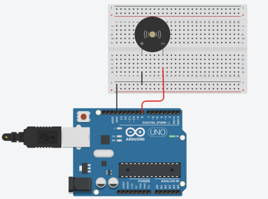    

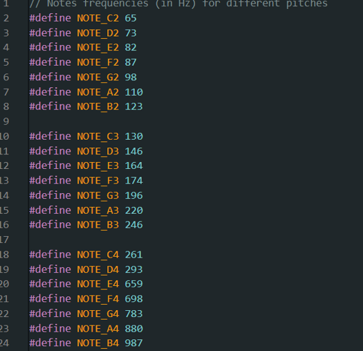
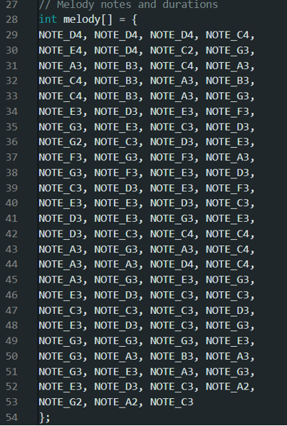
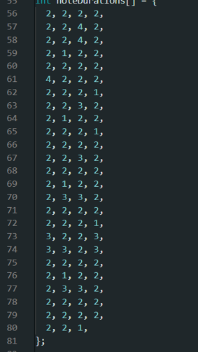
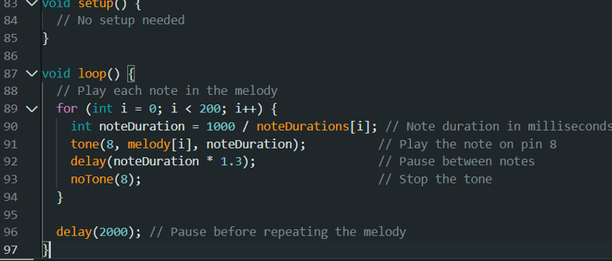
**IV.**        ຜົນຂອງການທົດລອງ

	ຜົນການທົດລອງການສາມາດສະຫລຸບໄດ້ວ່າ: ໂປຣເຈັກນີ້ຈະເປັນການສົ່ງສຽງຕາມຄຳສັ່ງຂອງເຮົາເຊັດຄ່າເອົາໄວ້. ເຊີ່ງໄດ້ມີການເລືອກເປັນໂນດຂອງເພງຊາດລາວ.

# ການທົດລອງຕໍ່ວົງຈອນ Labs:5  **ເກມເດົາສີຂອງດອກໄຟ**

**I.**        ຈຸດປະສົງແລະວົງຈອນການທົດລອງ

ໂປຣເຈັກນີ້ຈະເປັນການທີ່ເຮົານຳເອົາອຸປະກອນຕັ້ງແຕ່ Labs:1-4 ນໍາມາສ້າງເປັນເກມດົນສີຂອງດອກໄຟເຊີ່ງເຮົາຈະນຳໃຊ້ **Push button** **ໃນການກົດເພື່ອແລ້ວຈາກນັ້ນໃຫ້ເຮົາດົນສີຂອງດອກໄຟ** **RGB** **ວ່າມັນຈະຕົງກັບສີທີ່ເຮົາເດົາສີໄວ້ບໍ່ຫລັງຈາກນັ້ນມັນຈະມີສຽງສົ່ງອອກມາ.**

**II.**        ອຸປະກອນ

| ຊື່            | ຈຳນວນ |
| -------------- | ----- |
| Arduino ide    | * 1   |
| Breadboard     | * 1   |
| Resistor(220Ω) | * 5   |
| Resistor(10KΩ) | * 2   |
| Pushbutton     | * 2   |
| Piezo          | * 1   |
| LED            | * 2   |
| RGB            | * 1   |

**III.**        ວົງຈອນແລະໂຄດ

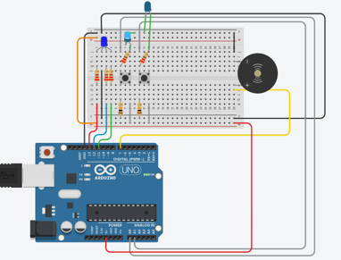
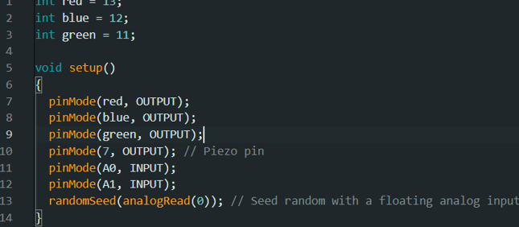
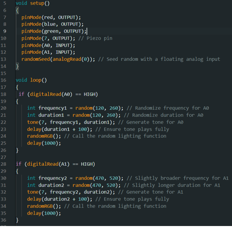
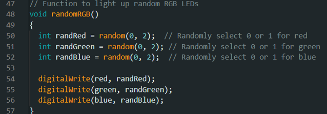

**IV.**          ຜົນຂອງການທົດລອງ

	ຜົນການທົດລອງການສາມາດສະຫລຸບໄດ້ວ່າ: ໂປຣເຈັກນີ້ເມື່ອເຮົາກົດປຸ່ມ Pushbutton ແລ້ວດອກໄຟຈະມີການຮຸ້ງຂື້ນມາແລວກໍ່ຈະເກິດສຽງຈາກ Piezo ອອກມາ. ເຊີ່ງດອກໄຟຕົວທີ່ເປັນ RGB ນັ້ນຈະມີການສຸ່ມສີຂອງດອກໄຟອອກມາເພື່ອໃຫ້ເຮົາໄດ້ມີການເລືອກວ່າມັນຈະສຸ່ມສີໃດອອກມາ.
# ການທົດລອງຕໍ່ວົງຈອນ Labs: 6 Potentiometer

**I.**  ຈຸດປະສົງແລະວົງຈອນການທົດລອງ

Potentiometer ແມ່ນອຸປະກອນອິເລັກໂທຣນິກທີ່ໃຊ້ໃນການຄວບຄຸມແຮງດັນໄຟຟ້າ ຫຼື ກະແສໄຟຟ້າ ໂດຍການປັບຄ່າຄວາມຕ້ານທານໃຫ້ແປຜັນໄດ້. ອຸປະກອນນີ້ມີບົດບາດສຳຄັນໃນການຄວບຄຸມຄວາມແຈ້ງຂອງໄຟ, ລະດັບສຽງ, ຫຼື ຄວາມໄວຂອງມໍເຕີໃນອຸປະກອນຕ່າງໆ.

v Potentiometer ເປັນໂປຣເຈັກທີ່ຈະໃຊ້ໃນການຄວບຄຸມຄວາມຮຸ້ງຂອງດອກໄຟ LED ຕາມທີ່ເຮົາຕ້ອງການ.

**II.**        ອຸປະກອນ

| ຊື່            | ຈຳນວນ |
| -------------- | ----- |
| Arduino ide    | * 1   |
| Breadboard     | * 1   |
| Resistor(220Ω) | * 1   |
| LED            | * 1   |
| Potentiometer  | * 1   |

**III.**        ວົງຈອນແລະໂຄດ

**IV.**          ຜົນຂອງການທົດລອງ

ຜົນການທົດລອງການສາມາດສະຫລຸບໄດ້ວ່າ: ໂປຣເຈັກນີ້ເປັນການຄວບຄຸມຄວາມສະຫວ່າງຂອງດອກໄຟ LED ຜ່ານໂຕຂອງ Potentiometer ເຊີ່ງເມື່ອເຮົາຄ່ອຍໆໜຸມໂຕຂອງ Potentiometer ຈະເຫັນໄດ້ວ່າ ດອກໄຟຈະມີການໄຕ່ສະດັບຄວາມສະຫວ່າງຂື້ນຈົນເຄິງຄ່າສຸງສຸດ.  

# ການທົດລອງຕໍ່ວົງຈອນ Labs: 7 Relay

**I.**        ຈຸດປະສົງແລະວົງຈອນການທົດລອງ

Relay ເປັນອຸປະກອນທີ່ເຮັດໜ້າທີ່ເໝືອນສະວິດໄຟຟ້າ ແລະ ມີບົດບາດສຳຄັນໃນການຄວບຄຸມການໄຫຼຂອງໄຟຟ້າໃຫ້ເປັນໄປຕາມທີ່ກຳນົດ. ຣີເລມີຫຼາຍປະເພດໃຫ້ເລືອກຕາມການນຳໃຊ້ໃນສະພາບແວດລ້ອມຕ່າງໆ. ຂະບວນການເຮັດວຽກຂອງມັນຄ້າຍຄືກັນ ໂດຍມີໜ້າທີ່ຕັດວົງຈອນໃນກໍລະນີທີ່ເກີດຄວາມຜິດປົກກະຕິ ເພື່ອຫຼຸດຄວາມເສຍຫາຍຕໍ່ອຸປະກອນໄຟຟ້າໃຫ້ໜ້ອຍທີ່ສຸດ.

 ^Relay ເປັນໂປຣເຈັກໃນການທີ່ຄວບຸມຂອງດອກໄຟ LED

**II.**        ອຸປະກອນ

| ຊື່            | ຈຳນວນ |
| -------------- | ----- |
| Arduino ide    | * 1   |
| Breadboard     | * 1   |
| Resistor(220Ω) | * 1   |
| RGB            | * 1   |
| Relay          | * 1   |

**III.**        ວົງຈອນແລະໂຄດ

**IV.**        ຜົນຂອງການທົດລອງ

	ຜົນການທົດລອງການສາມາດສະຫລຸບໄດ້ວ່າ: ໂດຍມັນເປັນວົງຈອນທີ່ຈະໃຊ້ Relay ໃຫ້ກັບດອກໄຟ LED 2 ດອກ ເມື່ອດອກໄຟ1ຮຸ້ງແລ້ວມັນຈະມີການ Relay ຈາກນັ້ນດອກໄຟດອກ2ກໍ່ຈະຮຸ້ງ ສ່ວນດອກທີ່1 ກໍຈະດັບລົງໄປ.

# ການທົດລອງຕໍ່ວົງຈອນ Labs: 8 Servo Motor

    I. ຈຸດປະສົງແລະວົງຈອນການທົດລອງ

	Servo Motor ແມ່ນອຸປະກອນທີ່ສາມາດຄວບຄຸມເຄື່ອງຈັກ ຫລື ລະບົບການເຮັດວຽກໃຫ້ເປັນໄປຕາມຄວາມຕ້ອງການ ເຊັ່ນ ຄວບຄຸມຄວາມໄວ (Speed), ຄວບຄຸມແຮງບິດ (Torque), ຄວບຄຸມຕໍາແໜ່ງ (Position) ໂດຍໃຫ້ຜົນລັບຕາມຄວາມຕ້ອງການດ້ວຍຄວາມແມ່ນຍໍາສູງ.

	 Servo Motor ເປັນໂປຣເຈັກທີ່ໃຊ້ໂຕຂອງ Potentiometer ໃນການຄວນບຄຸມການໝຸມຂອງ Motor.

   **II.**        ອຸປະກອນ

|   |   |
|---|---|
|ຊື່|ຈຳນວນ|
|Arduino ide|* 1|
|Breadboard|* 1|
|Servo Motor|* 1|
|Potentiometer|* 1|

 **III.**        ວົງຈອນແລະໂຄດ

 **IV.**        ຜົນຂອງການທົດລອງ

	ຜົນການທົດລອງການສາມາດສະຫລຸບໄດ້ວ່າ: ໂດຍມັນເປັນວົງຈອນທີ່ຈະໃຊ້ Potentiometer ໃນການຄວບຄຸມການໝຸມຂອງ Servo Motor. ເຊີ່ງ Servo Motor ມັນຈະມີການໝຸມຈະມີການເຄື່ອນທີ່ຕາມການບິດຂອງ Potentiometer ແລະ ມັນຈະສາມາດໝຸມໄດ້ທີ່ 180 ອົງສາ.

# ການທົດລອງຕໍ່ວົງຈອນ Labs: 9 7 Segment Display (ນັບຈາກ0-9ແລະ9-0)

    I.  ຈຸດປະສົງແລະວົງຈອນການທົດລອງ

	7 Segment Display ຫລື ຈໍສະແດງຜົນ 7 ສ່ວນ ແມ່ນອຸປະກອນອິເລັກທຣອນິກທີ່ໃຊ້ໃນການແສດງຕົວເລກ ແລະ ໃນບາງຄັ້ງກໍ່ສາມາດໃຊ້ແສດງຕົວອັກສອນບາງຕົວໄດ້. ມັນປະກອບຂຶ້ນຈາກຫລອດໄຟ LED ຫລື LCD ຈໍານວນ 7 ສ່ວນຫລັກ ທີ່ຖືກຈັດຮູບແບບໃຫ້ເປັນຮູບແບບສະເພາະເພື່ອການແສດງຜົນ.

	7 Segment Display ເປັນໂປຣເຈັກທີ່ຈະເປັນການບນັບຕົວເລກ

   **II.**        ອຸປະກອນ

| ຊື່               | ຈຳນວນ |
| ----------------- | ----- |
| Arduino ide       | * 1   |
| Breadboard        | * 1   |
| Resistor(500Ω)    | * 2   |
| 7 Segment Display | * 2   |

 **III.**        ວົງຈອນແລະໂຄດ

   

 **IV.**        ຜົນຂອງການທົດລອງ

	ຜົນການທົດລອງການສາມາດສະຫລຸບໄດ້ວ່າ: ໂດຍມັນເປັນວົງຈອນ ການນັບຕົວເລກ 0-9 ແລະ 9-0 ເຊີ່ງມັນຈະມີຄວາມໄວໃນການນັບນັ້ນຈະມີຢູ່ 1/2 ວິນາທີ. ຫລັງຈາກມັນມີການເຮັດໄວ້ຈົບລົງແລ້ວມັນກໍ່ຈະມີການວົນຊໍ້າໃຫມ່ເລີຍຈົນກວ່າເຮົາຈະສັ່ງຈຸດມັນເອງ.

# ການທົດລອງຕໍ່ວົງຈອນ Labs: 9 ວົງຈອນເປີດ-ປິດປະຕູ

    I. ຈຸດປະສົງແລະວົງຈອນການທົດລອງ

	ໂປຣເຈັກນີ້ຈະເປັນການນຳເອົາອຸປະກອນແຕ່ Labs:6-9 ເຊີ່ງມັນຈະເປັນວົງຈອນ ເປິດ-ປິດ ປະຕູ, ເຊີ່ງມັນຈະຕົວຄວບຄຸມໂດຍ Potentiometer ການໝຸມຂອງ Motor. ແຕ່ວົງຈອນນີ້ມີການທໍາງານຜ່ານການສະແດງຜົນຂອງ 7 Segment.

   **II.**        ອຸປະກອນ

**II.**        ອຸປະກອນ

| ຊື່               | ຈຳນວນ |
| ----------------- | ----- |
| Arduino ide       | * 1   |
| Breadboard        | * 1   |
| Resistor(220Ω)    | * 2   |
| Potentiometer     | * 1   |
| Servo Motor       | * 1   |
| 7 Segment Display | * 1   |

 **III.**        ວົງຈອນແລະໂຄດ

      

 **IV.**        ຜົນຂອງການທົດລອງ

	ຜົນການທົດລອງການສາມາດສະຫລຸບໄດ້ວ່າ: ໂດຍມັນເປັນວົງຈອນມັນເປັນວົງຈອນເປີດ-ປີດປະຕູ, ເມືອເຮົາເຮັດວຽກວົງຈອນມັນຈະສະແດງເລກ0 ແລະ1. ເມື່ອວົງຈອນສະແດງເລກ0 ປະຕູຈະບໍ່ມີການສະແດງ ຫລື ເກິດຫຍັງຂື້ນ ແຕ່ເມື່ອມັນສະແການສະແດງ ຫລື ເກິດຫຍັງຂື້ນ ແຕ່ເມື່ອມັນສະແດງເປັນເລກ1 ປະຕູ(Servo)ຈະໝຸມ.

# QR Code

Labs0

Labs1

Labs2

Labs3

Labs4

labs5

lab6

labs7

labs8

labs9

labs10